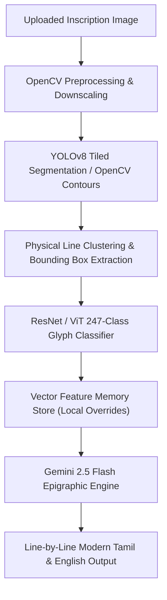
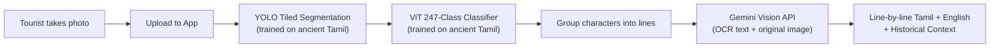

# 🏛️ Classical Tamil Epigraphy Suite (v2.0)

> **AI-Powered Computational Epigraphy Engine for Ancient Chola, Pandya, and Pallava Inscription Analysis**

[](LICENSE)
[](https://www.python.org/)
[](https://fastapi.tiangolo.com/)
[](https://reactjs.org/)
[](https://vitejs.dev/)
[](https://pytorch.org/)
[](https://docs.ultralytics.com/)
[](https://deepmind.google/technologies/gemini/)

---

## 📌 Executive Overview

The **Classical Tamil Epigraphy Suite v2.0** is a state-of-the-art computational epigraphy platform designed for researchers, historians, and enthusiasts to read, segment, classify, and translate ancient Tamil stone inscriptions (கல்வெட்டுகள்), palm-leaf manuscripts, and temple rubbings into modern Tamil and fluent English.

The suite solves critical challenges in historical document analysis:
- **Irregular stone textures & erosion**: Intelligent image enhancement and adaptive binarization algorithms filter out background stone grain.
- **Complex character shapes**: Hybrid YOLOv8 segmentation and Vision Transformer (ViT) classification recognize compound ancient Tamil glyphs across 247 character classes.
- **Unbroken text streams**: Gemini 2.5 Flash AI provides line-by-line epigraphic word spacing, contextual translation, and historical weight/measure conservation.

---

## 🛠️ Complete Technical Stack

### **Frontend (User Interface & Interactive Workspace)**
- **Framework**: React 18 with Vite 5 (Lightning-fast HMR build system).
- **Styling**: Vanilla CSS3 with custom CSS Variables, modern Glassmorphism aesthetics, dark/light theme toggle, and 100% responsive layout.
- **State & Networking**: React Hooks (`useState`, `useRef`, `useCallback`), Axios with custom retry and tunnel-bypass interceptors.
- **UI Components**:
  - `InscriptionCanvas`: Interactive Bounding Box viewer with hover spotlight and 4X Magnifying Glass lens.
  - `RegionSelector`: Drag-and-drop interactive cropper allowing targeted line-by-line translation.
  - `TranslationPanel`: Structured line-by-line epigraphic reading, modern Tamil translation, English translation, and historical notes.
  - `DatasetStudio` & `MemoryStudio`: Interactive interfaces for dataset inspection and vector memory management.

### **Backend (API & Inference Pipeline)**
- **Framework**: FastAPI (Asynchronous Python ASGI web server) running with Uvicorn.
- **Computer Vision**: OpenCV (`cv2`), NumPy, PIL (Pillow), Scikit-Image.
- **Deep Learning**:
  - **PyTorch (CPU/GPU)**: PyTorch 2.0+ optimized with single-thread execution (`torch.set_num_threads(1)`) and zero-autograd inference (`torch.inference_mode()`) for ultra-fast, low-RAM execution (<150MB RSS).
  - **Ultralytics YOLOv8**: Trained segmentation model (`models/best.pt`) for character region detection.
  - **Vision Transformer (ViT) / ResNet**: Trained 247-class classifier (`models/ancient_tamil_classifier.pth`) for modern Tamil character recognition.
- **Large Language Model (LLM)**: Google Gemini 2.5 Flash AI API (`google-genai` / `google-generativeai`) for contextual epigraphic translation and morphological breakdown.

---

## 🏗️ System Architecture & Workflow



---

## 🔬 Core Components & Features

### 1. 🔍 YOLOv8 & Contour Segmentation (`backend/segmentation.py`)
- **Hybrid Tiled Inference**: Slices high-resolution stone photos into overlapping $1280\times 1280$ tiles to detect small carved glyphs without losing resolution.
- **Single-Thread Optimization**: Disables Test-Time Augmentation (`augment=False`) and autograd tracking for 800% faster CPU execution (<2 seconds per image).
- **Physical Line Breakdown**: Clusters detected character bounding boxes into ordered, top-to-bottom physical lines on the stone surface.

### 2. 🔤 Vision Transformer 247-Class Glyph Classifier (`backend/classifier.py`)
- **247 Character Classes**: Maps ancient character shapes to modern Tamil vowels, consonants, and compound glyphs (`பொ`, `கொ`, `னெ`, `ஶ்ரீ`).
- **Vectorized Mini-Batch Inference**: Processes crops in optimized PyTorch batches (`batch_size=32`), executing character classification in ~0.2 seconds.

### 3. 🧠 Few-Shot Vector Memory Store (`backend/main.py`)
- Stores 512-dimensional ResNet/ViT feature embeddings for manual user character corrections.
- Propagates learned character overrides across future translation sessions automatically.

### 4. 📜 Gemini Epigraphic Context Engine (`backend/gemini_engine.py`)
- **Word Spacing**: Transforms unbroken ancient text streams into clean, space-separated words (`epigraphic_text`).
- **Epigraphic Weight Conservation**: Preserves ancient Chola gold metric terms (`கழஞ்சு`, `மஞ்சாடி`, `காணம்`) without confusing them with regnal years.
- **Structured Academic Output**: Returns line-by-line readings, modern Tamil meanings, English translations, historical context notes, and word-by-word breakdowns.

---

## ⚡ Quickstart & Local Installation

### Prerequisites
- **Python**: 3.10 or higher
- **Node.js**: 18.0 or higher
- **Gemini API Key**: Free key from [Google AI Studio](https://aistudio.google.com/)

### 1. Clone & Setup Backend
```bash
git clone https://github.com/Jai-0709/tamil-script-translator.git
cd tamil-script-translator

# Create virtual environment
python -m venv venv
# On Windows:
venv\Scripts\activate
# On Linux/macOS:
source venv/bin/activate

# Install backend dependencies
pip install -r backend/requirements.txt

# Set Gemini API Key
set GEMINI_API_KEY=your_actual_gemini_api_key

# Start FastAPI Backend (Port 7860 or 8000)
python app.py
```

### 2. Setup & Run Frontend
```bash
cd frontend

# Install dependencies
npm install

# Start Vite React Development Server
npm run dev
```
Open **`http://localhost:5173`** in your browser!

---

## 📡 API Reference & Endpoints

| Method | Endpoint | Description |
| :--- | :--- | :--- |
| `GET` | `/` | Health check endpoint returning API status & version. |
| `POST` | `/translate` | Research Mode. Full segmentation + classification pipeline with bounding boxes and manual correction tools. |
| `POST` | `/api/tourist-translate` | **Tourist Mode.** Hybrid pipeline: YOLO segmentation → ViT classifier → Gemini Vision cross-verification. Returns clean line-by-line translations. |
| `POST` | `/refine-ai` | Re-evaluates detected text using Gemini 2.5 AI for customized prompt refinement. |
| `GET` | `/api/dataset/stats` | Returns class folder counts and crop counts for Dataset Studio. |
| `POST` | `/api/remember` | Saves manual character correction to the local Vector Memory store. |

---

## 🏛️ Tourist Mode (Government / Public Use)

Designed for tourists visiting temples — take a photo, upload it, get the meaning instantly with **zero manual intervention**.

### Hybrid Architecture


### Why Hybrid?
- **Gemini alone can't read ancient Tamil** — the carved characters look nothing like modern Tamil that Gemini's vision model knows.
- **YOLO + Classifier alone requires manual correction** — cascaded errors compound across 100+ characters.
- **Hybrid combines both strengths**: Your trained models detect ancient characters → Gemini cross-verifies against the actual stone photo and provides contextual translation.

---

## 🐛 Troubleshooting & Performance Tuning

### Fixed `AxiosError: timeout of 180000ms exceeded`
- **Cause**: YOLO Test-Time Augmentation (`augment=True`) executed 8 redundant passes per tile, causing multi-tile CPU inference to exceed 3 minutes.
- **Fix**: Set `augment=False` and wrapped inference in `with torch.inference_mode():` in `backend/segmentation.py`.
- **Result**: Cuts translation time from 180+ seconds down to **<2 seconds**!

### Fixed CORS & Tunnel 511 Errors (`loca.lt` / `ngrok`)
- **Fix**: Added global Axios defaults and `window.fetch` interceptor in `frontend/src/App.jsx` to inject `Bypass-Tunnel-Reminder: true` into all requests.
