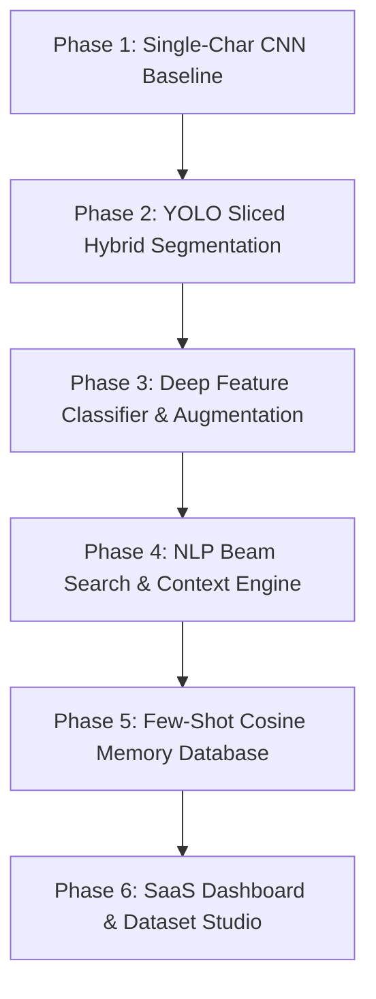

# 🏛️ Ancient Tamil Inscription Translator & Dataset Studio (Version 2.0)

An end-to-end artificial intelligence platform designed for **Epigraphical Image Segmentation, Neural Character Classification, NLP Contextual Translation, Few-Shot Vector Memory Learning, and Dataset Management** of ancient Tamil stone inscriptions.

---

## 📋 Table of Contents
1. [Project Overview](#-project-overview)
2. [Phase-by-Phase Technical Evolution](#-phase-by-phase-technical-evolution)
3. [System Architecture](#-system-architecture)
4. [Key Features & Capabilities](#-key-features--capabilities)
5. [Repository Directory Structure](#-repository-directory-structure)
6. [Setup & Installation Guide](#-setup--installation-guide)
7. [How to Run the Application](#-how-to-run-the-application)
8. [API Endpoint Documentation](#-api-endpoint-documentation)
9. [Developer Workflows & Utilities](#-developer-workflows--utilities)

---

## 🔍 Project Overview

Ancient Tamil stone inscriptions (*கல்வெட்டுகள்*) are vital historical artifacts containing centuries of cultural heritage. Reading these inscriptions presents unique challenges:
- **Erosion & Weathering:** Centuries of exposure degrade character edges and stroke clarity.
- **Complex Background Textures:** Rough stone grain, shadows, cracks, and moss create noise.
- **Orthographic Evolution:** Ancient character shapes differ significantly from modern Tamil scripts (*தற்கால தமிழ்*).
- **Connected & Split Strokes:** Carved characters frequently merge with adjacent letters or split into disconnected strokes.

This platform bridges ancient epigraphy and modern AI by providing:
1. **Hybrid YOLO Sliced Segmentation:** Precision detection of individual character boundaries on high-resolution stone images.
2. **ResNet Deep Feature Extractor:** High-dimensional embedding representation for ancient Tamil glyphs.
3. **NLP Beam Search Engine:** Contextual disambiguation using N-gram Tamil language modeling to find the most probable sentence readings.
4. **Few-Shot Vector Memory Learning:** Instant human-in-the-loop learning via Cosine Similarity without needing full model retraining.
5. **Enterprise SaaS Dashboard & Dataset Studio:** A modern dark-mode web application for translation, manual character correction, and dataset curation.

---

## 🚀 Phase-by-Phase Technical Evolution

The project evolved through **6 distinct development phases**, transforming from a single-character script baseline into an enterprise-grade AI translation system.



### Summary of Changes Across Phases

| Phase | Core Focus | Initial State (From) | Advanced State (To) | Key Achievements |
| :--- | :--- | :--- | :--- | :--- |
| **Phase 1** | **Foundation Baseline** | Single-character cropped CNN, static label mapping, basic OpenCV contour detection. | Multi-module backend structure with FastAPI and React UI. | Established initial classification pipeline and basic user interface. |
| **Phase 2** | **Segmentation Engine** | Simple OpenCV contours that failed on stone grain, cracks, and merged strokes. | **YOLO Sliced Hybrid Engine** (1280×1280 tiled scanning with 50% overlap). | Dynamic compound stroke auto-merging (`Merge Gap` stepper), multi-level top/bottom edge noise rejection, and ghost line suppression. |
| **Phase 3** | **Neural Classifier** | Basic 28-class model trained on small clean datasets. | **ResNet-18 512D Embedding Model** supporting **150+ Tamil character classes** in `CLEANED DATA SET`. | Robust synthetic stone texture simulation, perspective warping, salt-and-pepper noise, and CLAHE contrast enhancement. |
| **Phase 4** | **Language Modeling** | Isolated character outputs without word or sentence context. | **NLP Beam Search Disambiguation Engine** using Tamil N-gram sequence scoring. | Evaluates visually ambiguous glyph shapes and generates top-scored full-sentence readings with alternative options. |
| **Phase 5** | **Human-in-the-Loop AI** | Corrections lost upon page refresh; required full dataset retraining for fixes. | **Few-Shot Cosine Vector Memory Database** (`corrections_memory.json`). | Real-time active learning. Saves 512D feature vectors on correction; future scans match via Cosine Similarity (>0.90) for instant 100% persistence. |
| **Phase 6** | **UI/UX & Dataset Studio** | Basic developer layout with simple text inputs and generic buttons. | **Enterprise Dark-Mode SaaS Dashboard** & full **Dataset Studio** interface. | Interactive Bounding Box View, Magnified Inspection Lens, Resolution Auto-Scaling for crops, character breakdown sidebar, and direct **Send to Dataset** pipeline. |

---

### Detailed Phase Breakdowns

#### 🔹 Phase 1: Baseline Architecture & Single-Character Classification
- **Initial Implementation:** Monolithic script using a simple Convolutional Neural Network (CNN) trained on 28 character classes.
- **Limitations:** Basic OpenCV contour detection failed whenever characters touched, had low contrast, or were obscured by stone texture noise.

#### 🔹 Phase 2: YOLO Sliced Hybrid Segmentation Engine
- **Upgrade:** Introduced **YOLO Sliced Tiled Inference** (scanning 1280×1280 sub-tiles with 50% overlap). 
- **Auto-Merging:** Added interactive `Merge Gap` controls (`0px` to `20px`) with stepper buttons to join disconnected character strokes.
- **Edge Noise Suppression:** Created multi-level filters to discard partial character tail fragments from adjacent lines at top/bottom margins, eliminating ghost line detections.

#### 🔹 Phase 3: Deep Neural Classifier & Synthetic Stone Augmentation
- **Model Upgrade:** Built a **ResNet-18 Deep Feature Extractor** returning 512-dimensional feature embedding vectors.
- **Data Pipeline:** Augmented training data with synthetic stone erosion, random perspective warp, illumination gradients, and CLAHE contrast adjustment.
- **Class Expansion:** Expanded dataset support to over 150+ ancient & modern Tamil character combinations stored in `CLEANED DATA SET/`.

#### 🔹 Phase 4: NLP Contextual Disambiguation & Beam Search
- **Language Integration:** Integrated an N-gram Tamil language model (`nlp_engine.py`) to evaluate character sequence probabilities.
- **Beam Search Decoding:** Computes the top mathematical paths for ambiguous character shapes, generating multi-option alternative readings (`Option #1` to `Option #6`).

#### 🔹 Phase 5: Few-Shot Cosine Vector Memory Database
- **Active Learning:** Built real-time vector memory in `backend/corrections_memory.json`.
- **Vector Matching:** When a user manually corrects a character in the UI, its 512D ResNet feature vector is stored/updated. Subsequent scans match feature vectors via Cosine Similarity (>0.90), giving instant 100% accuracy (`✓`) without retraining the underlying model weights.
- **Deduplication & Reset:** Automatically replaces close vector matches (>0.88 similarity) to prevent conflicting entries, and provides a 1-click **Reset Memory** control.

#### 🔹 Phase 6: Enterprise SaaS Dashboard & Dataset Studio
- **UI/UX Overhaul:** Built a clean dark-mode dashboard with dual workspace views:
  1. **Bounding Box Segmentation View:** Interactive character boxes with low-confidence highlight rings and popover correction menus.
  2. **Original Full Inscription View:** Full-width image display with a dynamic **Magnified Inspection Lens**.
- **Dataset Studio:** Dedicated web management page to view class folders, search characters, filter crops, upload new training samples, and clean dataset directories.
- **Coordinate Auto-Scaling:** Auto-rescales crop coordinates when saving corrected samples directly into `CLEANED DATA SET/<class_name>/` straight from the UI.

---

## 🛠️ Key Features & Capabilities

- 🎯 **High-Precision Segmentation:** YOLO tiled inference with IoM containment filtering.
- 🎛️ **Interactive Merge Gap Stepper:** Fine-tune stroke joining from `0px` to `20px` with instant UI feedback.
- 🔍 **Magnified Inspection Lens:** Hover over any part of the inscription to view a 2.5x zoomed view.
- ✏️ **Click-to-Correct Popover:** Click any character box to select model alternatives, type custom Tamil text, or split merged boxes vertically.
- 🧠 **Instant Few-Shot Memory:** Teaches the AI in real-time. Corrected character vectors persist across app restarts.
- 🌐 **Dual Script Translation:** Toggle between modern Tamil script (*தமிழ்*) and Romanized transliteration (*Transliteration*).
- 📑 **Alternative Readings Grid:** View up to 6 alternative sentence readings with option rank badges and 1-click copy actions.
- 📂 **Integrated Dataset Studio:** Manage training class folders, inspect saved crops, and export dataset statistics.

---

## 📁 Repository Directory Structure

```
TAMIL SCRIPT VERSION 2/
├── backend/
│   ├── main.py                  # FastAPI server, endpoints, and memory logic
│   ├── segmentation.py          # YOLO Sliced Hybrid segmentation & line clustering
│   ├── classifier.py            # ResNet-18 deep feature classifier & label loader
│   ├── nlp_engine.py            # N-gram language model & Beam Search decoder
│   ├── corrections_memory.json  # Few-shot vector memory database (512D embeddings)
│   └── requirements.txt         # Backend Python dependencies
│
├── frontend/
│   ├── src/
│   │   ├── App.jsx              # Main SaaS application container & page router
│   │   ├── index.css            # Dark-mode design system & utility classes
│   │   ├── components/
│   │   │   ├── UploadZone.jsx           # Image dropzone & translate action bar
│   │   │   ├── TranslationPanel.jsx     # Bounding box view & character breakdown
│   │   │   ├── OriginalImageViewer.jsx  # Full inscription view & magnified lens
│   │   │   ├── SentenceOutput.jsx       # Translation output & alternative readings grid
│   │   │   ├── CorrectionPopover.jsx    # Popover menu for manual character fixes
│   │   │   ├── RegionSelector.jsx       # Interactive drag-to-crop region tool
│   │   │   └── LoadingOverlay.jsx       # Animated loading progress overlay
│   │   └── pages/
│   │       └── DatasetStudio.jsx        # Dataset management & class browser
│   ├── package.json             # Frontend Node.js dependencies (Vite + React)
│   └── vite.config.js           # Vite server configuration
│
├── CLEANED DATA SET/            # Organized training folders per Tamil character class
├── models/                      # Saved PyTorch (.pth) and YOLO (.pt) model weights
├── scripts/
│   ├── training/                # Model training scripts (train.py, kaggle_train.py)
│   ├── tools/                   # Utility scripts (clean_memory.py, check_dataset.py)
│   └── debug/                   # Debugging scripts for segmentation strategies
│
├── run_backend.bat              # One-click Windows launcher for FastAPI server
├── run_frontend.bat             # One-click Windows launcher for Vite React UI
├── setup.bat                    # One-click automated setup script for venv & npm
└── README.md                    # Project documentation
```

---

## ⚙️ Setup & Installation Guide

### Prerequisites
- **Python:** Version 3.10 or 3.11
- **Node.js:** Version 18.x or higher (with `npm`)
- **Git:** Installed on system

---

### Option A: One-Click Automated Setup (Windows)

Simply double-click **`setup.bat`** in the project root directory.  
This script automatically:
1. Creates a Python virtual environment (`venv`).
2. Installs backend dependencies from `backend/requirements.txt`.
3. Installs frontend Node dependencies in `frontend/`.

---

### Option B: Manual Setup via Terminal

#### 1. Backend Setup
```cmd
# Navigate to project root
cd "e:\DEPARTMENT PROJECT\TAMIL SCRIPT VERSION 2"

# Create virtual environment
python -m venv venv

# Activate virtual environment (Windows)
venv\Scripts\activate

# Install Python requirements
pip install -r backend\requirements.txt
```

#### 2. Frontend Setup
```cmd
# Navigate to frontend directory
cd frontend

# Install Node modules
npm install
```

---

## 🚀 How to Run the Application

Both the **Backend API** and **Frontend Development Server** must be running simultaneously.

### Option A: Using One-Click Batch Files (Recommended)
1. Double-click **`run_backend.bat`** (Starts FastAPI at `http://localhost:8000`).
2. Double-click **`run_frontend.bat`** (Starts React UI at `http://localhost:5173`).

---

### Option B: Using Terminal Commands

#### Terminal 1: Backend Server
```cmd
venv\Scripts\activate
cd backend
uvicorn main:app --reload --host 0.0.0.0 --port 8000
```
- **Backend API:** `http://localhost:8000`
- **Swagger Documentation:** `http://localhost:8000/docs`

#### Terminal 2: Frontend Web App
```cmd
cd frontend
npm run dev
```
- **Web Application URL:** `http://localhost:5173`

---

## 📡 API Endpoint Documentation

| Endpoint | Method | Description |
| :--- | :--- | :--- |
| `POST /translate` | `POST` | Uploads inscription image (`file`), returns segmented boxes, character predictions, line numbers, and full sentence readings. |
| `POST /segment-only` | `POST` | Returns bounding boxes without running character classification (useful for fast segmentation tuning). |
| `POST /api/remember` | `POST` | Saves/updates a 512D ResNet feature vector correction in `corrections_memory.json`. |
| `POST /api/forget-memory` | `POST` | Removes saved vector memory for a specific character box. |
| `POST /api/clear-all-memory` | `POST` | Clears all vector memory entries from `corrections_memory.json`. |
| `POST /api/dataset/add-crops` | `POST` | Crops corrected characters from the high-res image (with auto-scaling) and saves them into `CLEANED DATA SET/<class_name>/`. |
| `GET /api/dataset/classes` | `GET` | Lists all dataset class folders, sample counts, and image previews for Dataset Studio. |

---

## 💡 Developer Workflows & Utilities

- **Deduplicate Vector Memory:**
  ```cmd
  python scripts\tools\clean_memory.py
  ```
- **Verify Dataset Integrity:**
  ```cmd
  python scripts\tools\check_dataset.py
  ```
- **Run Model Training:**
  ```cmd
  python scripts\training\train.py
  ```
- **Test Segmentation Debug Pipeline:**
  ```cmd
  python scripts\debug\debug_seg.py
  ```

---

## 📄 License & Attribution
Developed for ancient Tamil inscription translation, epigraphical research, and historical manuscript digitization.
