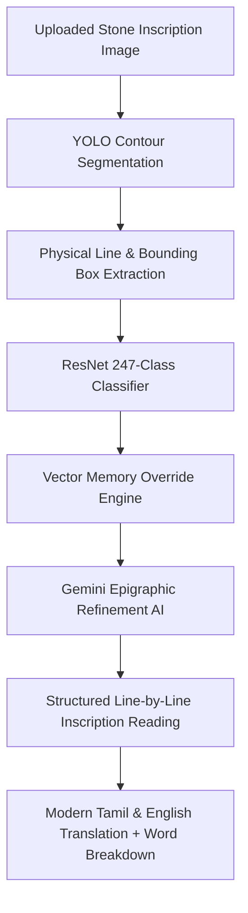

# 🏛️ Classical Tamil Epigraphy Suite (v2.0)
> **AI-Powered Computational Epigraphy Engine for Ancient Chola, Pandya, and Pallava Inscription Analysis**

[](LICENSE)
[](https://www.python.org/)
[](https://fastapi.tiangolo.com/)
[](https://reactjs.org/)
[](https://vitejs.dev/)
[](https://pytorch.org/)
[](https://deepmind.google/technologies/gemini/)

---

## 📌 Executive Overview

The **Classical Tamil Epigraphy Suite v2.0** is an end-to-end computational epigraphy and optical character recognition (OCR) platform tailored for reading, segmenting, classifying, and translating ancient Tamil stone inscriptions (கல்வெட்டுகள்), palm-leaf manuscripts, and temple rubbings into modern Tamil and fluent English.

Combining **YOLO Smart-Tiled Contour Segmentation**, a **ResNet 247-Class Modern Tamil Glyph Classifier**, a **Real-Time Vector Memory Store**, and **Gemini Epigraphic Context Refinement**, the suite provides line-by-line inscriptional translation, grammatical breakdown, and epigraphic gold weight conservation.

---

## ✨ Key Features & Technical Capabilities

### 1. 🔍 Pure YOLO & Contour Line/Character Segmentation
- **Zero Artificial Box Splitting**: Uses authentic contour segmentation to preserve single compound Tamil glyphs (`பொ`, `கொ`, `னெ`).
- **Physical Line Breakdown**: Automatically groups detected bounding boxes by physical stone inscription lines.
- **Interactive 72vh Crop Region Mode**: High-resolution interactive cropping allowing users to draw precise target boxes across any inscription line.

### 2. 🔤 ResNet 247-Class Glyph Classifier & Vector Memory
- Matches extracted ancient character crops against all 247 modern Tamil alphabet classes.
- **Interactive Character Breakdown**: Hover over any detected bounding box for instant 4X lens magnification and spotlighting.
- **Few-Shot Vector Memory Store**: Retains manual character overrides locally (`vector_memory`), propagating learned corrections across sessions.

### 3. 📜 Gemini Epigraphic Analysis Engine (Line-by-Line)
- **Epigraphic Word Spacing**: Inserts clean word spaces between ancient Tamil words (`epigraphic_text`), avoiding concatenated unbroken text.
- **Epigraphic Weight & Measurement Conservation**: Protects ancient gold weight metrics (`கழஞ்சு`, `கழஞ்சரை`, `மஞ்சாடி`) from misinterpretation as regnal year formulas.
- **Structured Per-Line Packages**: Returns line-by-line readings, modern Tamil meanings, English translations, historical context notes, and word breakdowns.
- **Bilingual Tamil + English Mode**: Academic-grade publication format with zero decorative emojis.

### 4. 📊 Dataset & Memory Studio
- **Dataset Studio**: Inspect, search, filter, and delete class folder crops or export labelled training sets (`JSON`).
- **Memory Studio**: Backup vector feature embeddings and saved image layout coordinates.

### 5. 📱 100% Mobile & Tablet Responsive Architecture
- Apple-inspired design system with dark/light themes.
- Animated mobile navigation drawer and responsive 1-column single-page layout for smartphones.

---

## 🏗️ System Architecture



---

## ⚡ Local Installation & Quickstart

### Prerequisites
- **Python**: 3.10 or higher
- **Node.js**: 18.0 or higher
- **Gemini API Key**: Obtain from [Google AI Studio](https://aistudio.google.com/)

### 1. Setup Backend
```bash
# Navigate to project root
cd "TAMIL SCRIPT VERSION 2"

# Create virtual environment
python -m venv venv
# On Windows:
venv\Scripts\activate
# On Linux/macOS:
source venv/bin/activate

# Install dependencies
pip install -r backend/requirements.txt

# Set Gemini API Key
set GEMINI_API_KEY=your_actual_gemini_api_key

# Start FastAPI server
python app.py
```

### 2. Setup Frontend
```bash
# Navigate to frontend
cd frontend

# Install dependencies
npm install

# Start Vite development server
npm run dev
```

Open your browser at `http://localhost:5173`.

---

## 🌐 100% FREE Deployment Options (No Docker, No Credit Card Required)

| Component | 100% Free Platform | Hosting Specs |
| :--- | :--- | :--- |
| **Frontend (React)** | **Vercel** / **Netlify** | 100% Free, Global CDN, Free SSL |
| **Backend (FastAPI)** | **Render.com** *(Native Python Web Service)* or **Hugging Face (Gradio SDK)** | **100% FREE CPU Basic** (No credit card or paid Docker plan needed!) |

*For complete step-by-step 100% free deployment instructions, refer to [docs/deployment_hosting_guide.md](docs/deployment_hosting_guide.md).*

---

## 📜 License & Acknowledgments

- Developed for Epigraphic Research & Computational Tamil Linguistics.
- **License**: MIT License.
